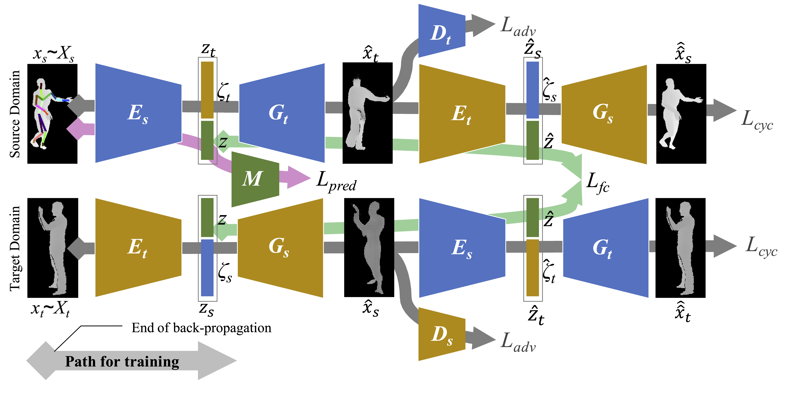
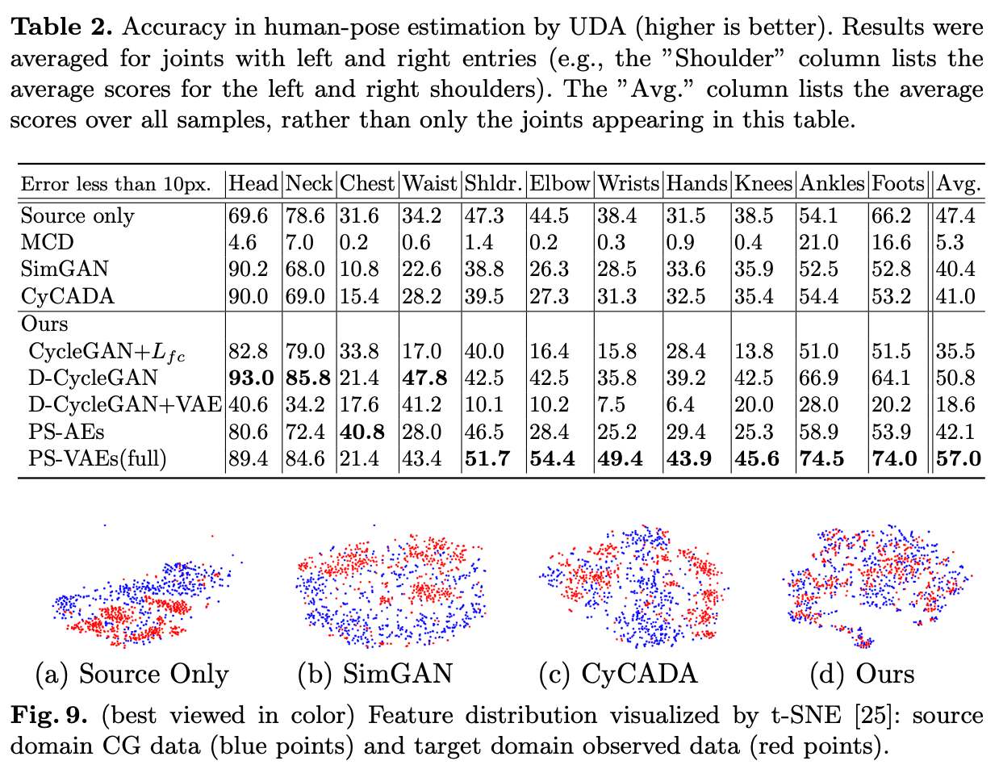

# Partially-Shared Variational Auto Encoders
This is the implementation of Partially-Shared Variational Auto Encoders (PS-VAEs) for pose estimation and digits classification in Pytorch.
The code is written by Ryuhei Takahashi and Atsushi Hashimoto. The work was accepted by ECCV 2020 Poster.


# What is Target Shift? What is the problem
<p>

Target shift, also known as prior distribution shift, is a shift in label distribution  between source and target domains.
  
In general unsupervised domain adapation settings, the shape of label distribution in the target domain dataset is unknown because the labels are inaccessible.
Hence, it cannot be ensured that the label distributions  in the source and target domains are identical.
Despite of this fact, many UDA methods rely on adversarial training with a simple domain discreminator. Such methods try to match in the shape of two feature distributions. Because they use a common classifier/regressor between domains, such a method always forces the model to output the source label distributions for target domain dataset. In other words, it implicitly assumes the identical label distribution between the two domains.

Some other methods does not rely on such adversarial training, but often assumes the existence of category boundaries, entropy-based importance weight calculation, which are applicalbe only to clasiffication problems but not for regression. 

The proposed method, _PS-VAEs_, is the only method that is applicable for both classification and regression problems under target shift without relying on any prior knowledge of domain-invariant sample similarity metric.
<br clear="all">
</p>

# Network Architecture and Algorithm
The entire network architecture.


Partially-shared Encoder and Decoder for label preserving domain conversion.

<br clear="all">

# Experimental Results
## Pose Estimation




## Digit Classification
Note that X% represents the strength of the target shift (larger is stronger). 


# Paper and Citation
- [The paper on arXiv](https://arxiv.org/abs/2001.07895)
- Citation Info (If you use this code for your research, please cite our papers).
```
@InProceedings{takahashi2020partially,
  title={Partially-Shared Variational Auto-encoders for Unsupervised Domain Adaptation with Target Shift},
  author={Takahashi, Ryuhei and Hashimoto, Atsushi and Sonogashira, Motoharu and Iiyama, Masaaki},
  booktitle = {The European Conference on Computer Vision (ECCV)},
  year={2020}
}
```

# License
The code in this repository is published under [the MIT License](LICENSE).
